## MERN STACK IMPLEMENTATION

## Step 1 –Backend configuration

`sudo apt update`

`sudo apt upgrade`

`curl -sL https://deb.nodesource.com/setup_12.x | sudo -E bash -`

Install Node.js on the server

`sudo apt-get install -y nodejs`

Verify the node installation with the commands below

`node -v`
`npm -v`

## Application Code Setup

Create a new directory for your To-Do project:

`mkdir Todo`

Run the command below to verify that the Todo directory is created 

`ls`

Can use following combination of keys `ls -lih –` it will show you different properties and size in human readable format.

Now change your current directory to the newly created one:

`cd Todo`

Next, you will use the command npm init to initialise your project, so that a new file named package.json will be created. This file will normally contain information about your application and the dependencies that it needs to run. Press Enter several times to accept default values, then accept to write out the package.json file by typing yes.

`npm init`

Run `ls` to confirm that package.json file created

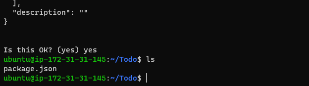

## INSTALL EXPRESSJS IN TO DIRECTORY

To use express, install npm

`npm install express`

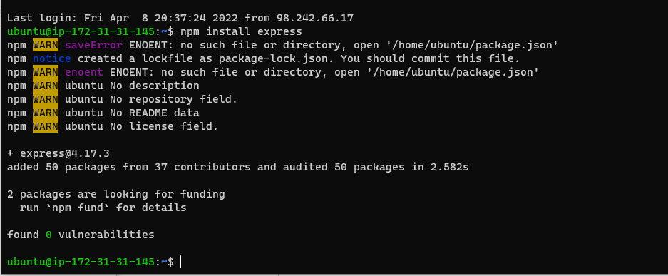

`touch index.js`

Run `ls` to confirm that your index.js file is successfully created

`npm install dotenv`

Run `vim index.js` copy and paste the commad below in the empty file

`const express = require('express');
require('dotenv').config();

const app = express();

const port = process.env.PORT || 5000;

app.use((req, res, next) => {
res.header("Access-Control-Allow-Origin", "\*");
res.header("Access-Control-Allow-Headers", "Origin, X-Requested-With, Content-Type, Accept");
next();
});

app.use((req, res, next) => {
res.send('Welcome to Express');
});

app.listen(port, () => {
console.log(`Server running on port ${port}`)
});`

Port 5000 in code was created, Use `:w` to save in vim and use `:qa` to exit vim

`node index.js` in todo directory

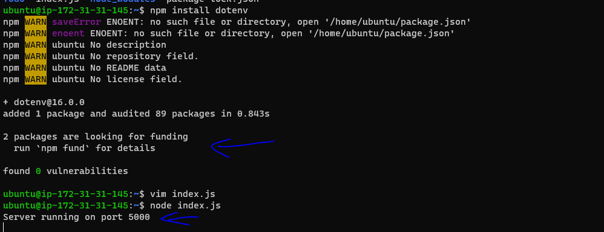

Open this port in EC2 Security Groups, where  an inbound rule was created to open TCP port 80, to create TCP port 5000.

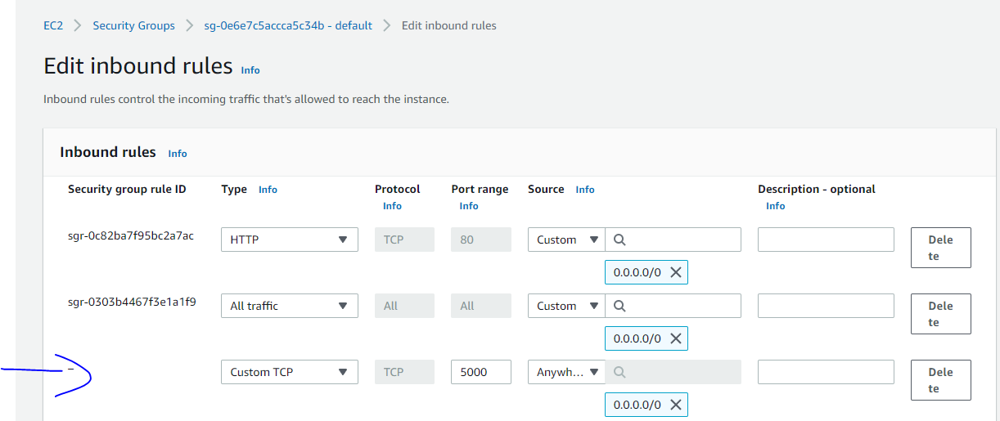

`http://<PublicIP-or-PublicDNS>:5000` Copy public IP address and paste on web for result below "Welcome express"

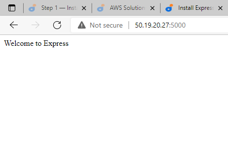

## ROUTES
There are three actions that our To-Do application needs to be able to do:

Create a new task
Display list of all tasks
Delete a completed task

`mkdir routes`

`cd routes`

`touch api.js`

`vim api.js` This commad will create a blank page for the commad below

`const express = require ('express');
const router = express.Router();

router.get('/todos', (req, res, next) => {

});

router.post('/todos', (req, res, next) => {

});

router.delete('/todos/:id', (req, res, next) => {

})

module.exports = router;`

Use `:wq` to save and exit

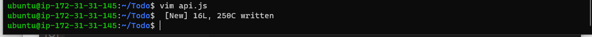

To exit fro current directory to previous directory `cd ..` 

## Change directory back Todo folder with cd .. and install Mongoose

CREATING MODELS

`npm install mongoose`

A `mkdir models`

B `cd models`

C `touch todo.js`

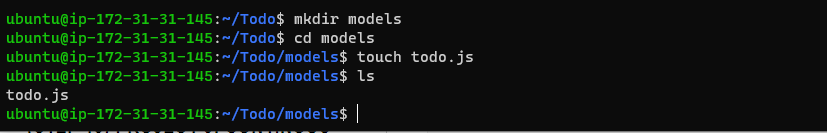

`mkdir models && cd models && touch todo.js` can paste all 3 commands once.

Open the file created with `vim todo.js` then paste the code below in the file

`const mongoose = require('mongoose');
const Schema = mongoose.Schema;

//create schema for todo
const TodoSchema = new Schema({
action: {
type: String,
required: [true, 'The todo text field is required']
}
})

//create model for todo
const Todo = mongoose.model('todo', TodoSchema);

module.exports = Todo;`

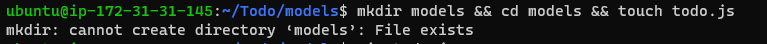

Use `:wq` save and exit

Update to routes from the file `api.js` in ‘routes’ directory to make use of the new model.

In Routes directory, open api.js with `vim api.js` delete the code inside with `:%d` command and paste there code below into it then save and exit `:wq`

`const express = require ('express');
const router = express.Router();
const Todo = require('../models/todo');

router.get('/todos', (req, res, next) => {

//this will return all the data, exposing only the id and action field to the client
Todo.find({}, 'action')
.then(data => res.json(data))
.catch(next)
});

router.post('/todos', (req, res, next) => {
if(req.body.action){
Todo.create(req.body)
.then(data => res.json(data))
.catch(next)
}else {
res.json({
error: "The input field is empty"
})
}
});

router.delete('/todos/:id', (req, res, next) => {
Todo.findOneAndDelete({"_id": req.params.id})
.then(data => res.json(data))
.catch(next)
})

module.exports = router;`

CREATING A MONGODB DATABASE

[Create a mongoose account](https://cloud.mongodb.com/v2/62523dfb291a8721d378f9cf#clusters/connect?clusterId=Cluster0)

  
  Create a cluster

  Network address-create IP address (for this project chose anywhere. 6hours-1 week)

  Database accesses - create information needed and leave default settings.

  Database- click collections to create database name

  To connect - click on connection then application coonection to paste this code `DB = mongodb+srv://<username>:<password>@<network-address>/<dbname>?retryWrites=true&w=majority` on terminal after editing to right information, under application connection most of the information is there. Add username, password, networt-address, and dbname.

  Create a file in your Todo directory and name it .env.

  `touch .env`
   `vi .en`

  `DB = mongodb+srv://<username>:<password>@<network-address>/<dbname>?retryWrites=true&w=majority`

  

  Open the file with `vim index.js` then delete existing file
  

  To delete vim file or code- esc, then `:%d` press enter

  copy and past this code below

`const express = require('express');
const bodyParser = require('body-parser');
const mongoose = require('mongoose');
const routes = require('./routes/api');
const path = require('path');
require('dotenv').config();

const app = express();

const port = process.env.PORT || 5000;

//connect to the database
mongoose.connect(process.env.DB, { useNewUrlParser: true, useUnifiedTopology: true })
.then(() => console.log(`Database connected successfully`))
.catch(err => console.log(err));

//since mongoose promise is depreciated, we overide it with node's promise
mongoose.Promise = global.Promise;

app.use((req, res, next) => {
res.header("Access-Control-Allow-Origin", "\*");
res.header("Access-Control-Allow-Headers", "Origin, X-Requested-With, Content-Type, Accept");
next();
});

app.use(bodyParser.json());

app.use('/api', routes);

app.use((err, req, res, next) => {
console.log(err);
next();
});

app.listen(port, () => {
console.log(`Server running on port ${port}`)
});

Using environment variables to store information is considered more secure and best practice to separate configuration and secret data from the application, instead of writing connection strings directly inside the index.js application file.

Start your server using the command:

`node index.js`

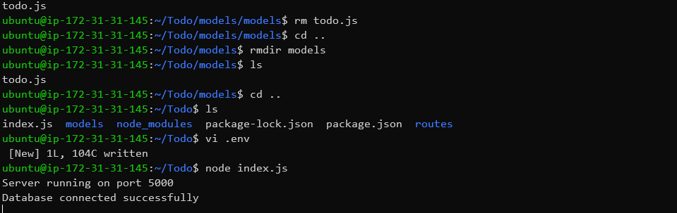

## CREATING A POSTMAN ACCOUNT

  make sure your set header key Content-Type as application/json

  Click on body and select raw

  CREATE - HTTP GET request, HTTP POST request, then send request.
   

 `http://<PublicIP-or-PublicDNS>:5000/api/todos`
  
   
  [Postman](https://www.postman.com/interstellar-firefly-586561/workspace/nemi-bonnie/request/create?requestId=37e7531e-34ae-4a65-aae7-ae05a9880dc4)

  

  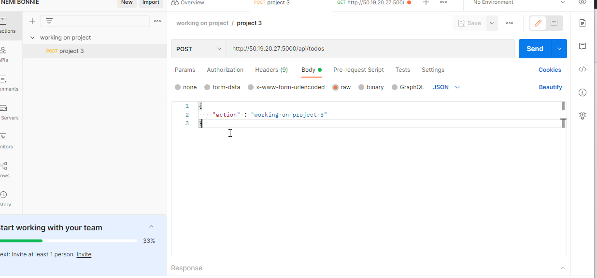

 ##  FRONTEND CREATION

`npx create-react-app client` in todo directory

I had a problem installing npx create-react-app client because node.js version is not updated. This is how I updated it.
  
  `sudo npm cache clean -f`

  `sudo npm install -g n`

  `sudo n stable`
  

`npm install concurrently --save-dev` in todo directory

`npm install nodemon --save-dev` in todo directory

`vi package.json` open in todo directory, delete current script and copy new code below

"scripts": {
"start": "node index.js",
"start-watch": "nodemon index.js",
"dev": "concurrently \"npm run start-watch\" \"cd client && npm start\""
},

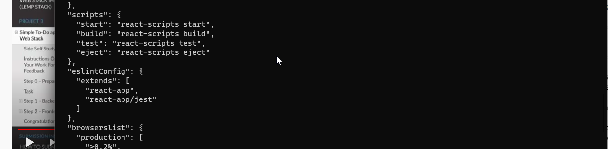

`vi package.json` open in client directory, copy and paste `"proxy": "http://localhost:5000".` like below image. adding the proxy permits not copy the entire `http://localhost:5000/api/todos` but rather use http://localhost:5000 which is much easier.

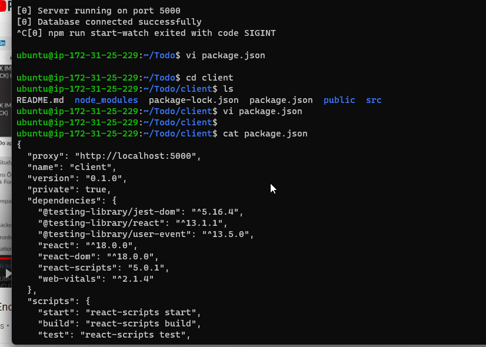

cd into todo directory  and run `npm run dev`

`cd client`

`cd src`

`mkdir components`

`cd components`

Inside ‘components’ directory create three files `touch Input.js ListTodo.js Todo.js`

`vi Input.js` Copy and paste the following

import React, { Component } from 'react';
import axios from 'axios';

class Input extends Component {

state = {
action: ""
}

addTodo = () => {
const task = {action: this.state.action}

    if(task.action && task.action.length > 0){
      axios.post('/api/todos', task)
        .then(res => {
          if(res.data){
            this.props.getTodos();
            this.setState({action: ""})
          }
        })
        .catch(err => console.log(err))
    }else {
      console.log('input field required')
    }

}

handleChange = (e) => {
this.setState({
action: e.target.value
})
}

render() {
let { action } = this.state;
return (

<input type="text" onChange={this.handleChange} value={action} />
<button onClick={this.addTodo}>add todo</button>

)
}
}

export default Input

copy the code above inside the file you created

INSTALL Axios in CLIENT DIRECTORY

`npm install axios`

Go to ‘components’ directory `cd src/components`

open `vi ListTodo.js` copy and paste code below

import React from 'react';

const ListTodo = ({ todos, deleteTodo }) => {

return (
<ul>
{
todos &&
todos.length > 0 ?
(
todos.map(todo => {
return (
<li key={todo._id} onClick={() => deleteTodo(todo._id)}>{todo.action}</li>
)
})
)
:
(
<li>No todo(s) left</li>
)
}
</ul>
)
}

export default ListTodo

Then in your `vi Todo.js` file you write the following code, in the same directory as above.

import React, {Component} from 'react';
import axios from 'axios';

import Input from './Input';
import ListTodo from './ListTodo';

class Todo extends Component {

state = {
todos: []
}

componentDidMount(){
this.getTodos();
}

getTodos = () => {
axios.get('/api/todos')
.then(res => {
if(res.data){
this.setState({
todos: res.data
})
}
})
.catch(err => console.log(err))
}

deleteTodo = (id) => {

    axios.delete(`/api/todos/${id}`)
      .then(res => {
        if(res.data){
          this.getTodos()
        }
      })
      .catch(err => console.log(err))

}

render() {
let { todos } = this.state;

    return(
      

        <h1>My Todo(s)</h1>
        <Input getTodos={this.getTodos}/>
        <ListTodo todos={todos} deleteTodo={this.deleteTodo}/>
      

    )

}
}

export default Todo;

Then `cd ..` to move to src folder

src folder `vi App.js` delete code and paste code below

import React from 'react';

import Todo from './components/Todo';
import './App.css';

const App = () => {
return (

<Todo />

);
}

export default App;

open src folder `vi App.css` delete code inside file, and paste the code below

.App {
text-align: center;
font-size: calc(10px + 2vmin);
width: 60%;
margin-left: auto;
margin-right: auto;
}

input {
height: 40px;
width: 50%;
border: none;
border-bottom: 2px #101113 solid;
background: none;
font-size: 1.5rem;
color: #787a80;
}

input:focus {
outline: none;
}

button {
width: 25%;
height: 45px;
border: none;
margin-left: 10px;
font-size: 25px;
background: #101113;
border-radius: 5px;
color: #787a80;
cursor: pointer;
}

button:focus {
outline: none;
}

ul {
list-style: none;
text-align: left;
padding: 15px;
background: #171a1f;
border-radius: 5px;
}

li {
padding: 15px;
font-size: 1.5rem;
margin-bottom: 15px;
background: #282c34;
border-radius: 5px;
overflow-wrap: break-word;
cursor: pointer;
}

@media only screen and (min-width: 300px) {
.App {
width: 80%;
}

input {
width: 100%
}

button {
width: 100%;
margin-top: 15px;
margin-left: 0;
}
}

@media only screen and (min-width: 640px) {
.App {
width: 60%;
}

input {
width: 50%;
}

button {
width: 30%;
margin-left: 10px;
margin-top: 0;
}
}

In the src directory open the index.css `vim index.css` paste code below

body {
margin: 0;
padding: 0;
font-family: -apple-system, BlinkMacSystemFont, "Segoe UI", "Roboto", "Oxygen",
"Ubuntu", "Cantarell", "Fira Sans", "Droid Sans", "Helvetica Neue",
sans-serif;
-webkit-font-smoothing: antialiased;
-moz-osx-font-smoothing: grayscale;
box-sizing: border-box;
background-color: #282c34;
color: #787a80;
}

code {
font-family: source-code-pro, Menlo, Monaco, Consolas, "Courier New",
monospace;
}

Go to the Todo directory

cd ../..

npm run dev

